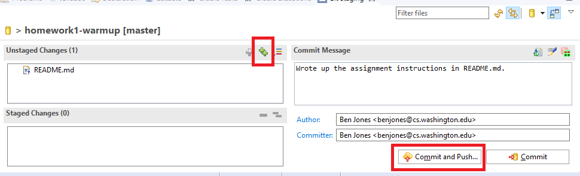

# Homework 1 - Warmup

The purpose of this assignment is to make sure that your development
environment is set up properly, to gain familiarity with your IDE,
build system, and version control, and to practice Java basics
before diving into the larger partnered projects.

## Getting Started

First, install and set up Eclipse [as described on the course webpage](https://courses.cs.washington.edu/courses/cse373/18su/resources/eclipse-setup.html).
Be sure to follow the instructions at the bottom of the page for adding SSH keys to
Gitlab!

Next, follow the [instructions](https://courses.cs.washington.edu/courses/cse373/18su/resources/eclipse-git-gradle-loading.html)
for loading a Gradle project into Eclipse from a git repository.

### File Organization

Java build systems are very particular about where code files go. For this
course we will be using the Gradle build system. All of the source code goes
in the "src" (source) directory. This is divided into "main" and "test" code,
and then further subdivided by programming language. Since this project only
contains java code, the two directories where code live are "src/main/java"
and "src/test/java". Any java packages are reflected in further directory
hierarchies under these ones. Since we are using the default package for this
project, there are no more directories, but in future projects the code will
be further organized. Classes in "src/main/java/my.package" and those in
"src/test/java/my.package" are seen by Java as being in the same package
(this is why we don't need to import our own classes in our tests).

## What You Need To Do

You are given a Stack and Queue interface (ADTs), along with three implementing classes:
- ArrayStack.java
- ListStack.java
- ListQueue.java

Of these three, ListStack is already implemented for you as an example.

You are also given JUnit tests for these three implementations:
- TestArrayStack.java
- TestListStack.java
- TestListQueue.java

Your task is to fill out the implementation of ArrayStack.java and ListQueue.java. Use
the provided tests to guide your implementation. **Do not** modify the interfaces, nor
the tests (except to add to the tests). Part of your evaluation will be if your code
passes all of the tests.

For the ArrayStack, your default constructor should initialize a size 10 array. Every time
you need to make more space, you should double the size of the array. In order to avoid
wasting too much space, you should also shrink your array by half whenever it is less
than one quarter full. Be careful not to shrink the array away to nothing! A good way
to avoid this is to have a minimum size that the array can shrink to. The starting capacity
of 10 is a good minimum size to use.

You will find that Java does not allow you to instantiate a generic array, i.e.
`T[] myArray = new T[someLength]` generates an error. To get around this,
you can use the pattern `T[] myArray = (T[]) Object[someLength]` - you
instantiate an array of type `Object[]` and then cast it to type `T[]`. This will
generate warnings because it is generally not safe to blindly cast arrays to different
types. If you want to get rid of those warning, click on the small warning symbol in
Eclipse and ask it to add `@SuppressWarnings` to that code.

You are not allowed to use any code from `java.util` except for the Exceptions already
imported and specified in the interfaces: `java.util.NoSuchElementException` and
`java.util.EmptyStackException`. 

Please adhere to the coding style guidelines set forth in the checkstyle file you
set up in the Installing and Setting Up Eclipse guide.

## Using git effectively

The two main purposes of using git are to checkpoint your work, and to work collaboratively
with others. Since this is a solo project, you will mainly be using git to checkpoint your
work. Whenever you get something new working, it is a good idea to commit your work. In
Eclipse, this is done by right-clicking (CMD-click)  your project in the Package Explorer,
and selecting "Team > Commit...". 

Click the green double plus signs in the "Unstaged Changes"
area to tell git that you want to checkpoint all of the files you have changed. If you only
want to checkpoint certain files, you can select them individually. Be careful if you do this,
since files will sometimes depend on each other (it is less risky in this project, but can 
become a problem in more complicated ones).

In the commit message text field, write a description of what you changed. This is important
so that if something breaks later, you can know what you did at each step and go back to one
you know to work. Finally, make sure the Author and Committer fields have your name and e-mail
address in them, and click "Commit" or "Commit and Push". The former just checkpoints on your
local machine, and the later checkpoints on your local machine, then sends that checkpoint back
to Gitlab. This is how we will collect your assignment, **so make sure you Push before the
assignment is due**. Since git only pushes up the differences in files, doing a push is very
fast, so you should probably push whenever you commit if you are connected to the internet.

*This push-every-time advice will change if you are working with somebody, but you don't
need to worry about that for this assignment since you are working alone.*

## Submitting Your Code

Before turning in your code, run checkstyle and correct any errors it finds.
You should be committing your code often to the repository (see above). When you are done
with your code, commit and push it, then *tag* that commit as `SUBMIT`. To tag a commit
in Eclipse, right-click your project and select "Team > Advanced > Tag", then write `SUBMIT`
in the "Tag Name" field. The "Tag Message" can be whatever you want - it is like a commit
message. Then click **Create Tag and Start Push**. It is *very important* that you do this
instead of just "Create Tag" so that it gets pushed back to Gitlab instead of staying on
your machine. If you forget to push the tag, you can do so via "Team > Remotes > Push Tags..."

